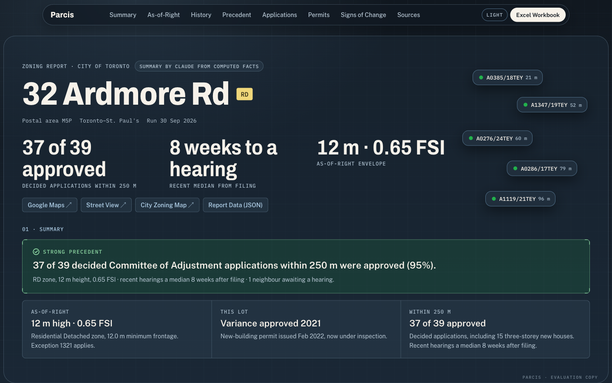
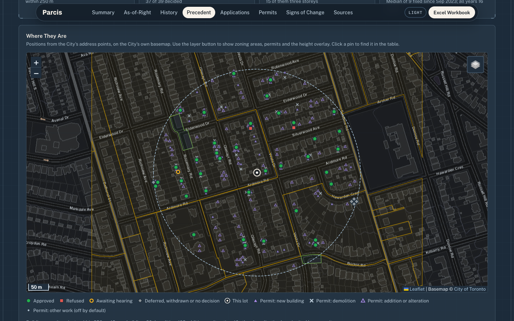
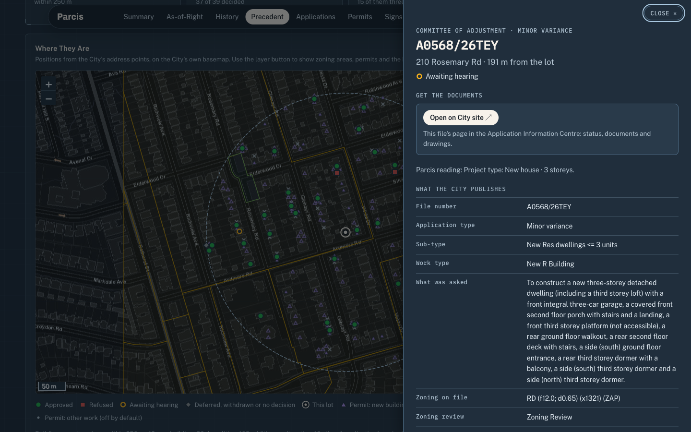

# Toronto Zoning Agent

**Copyright © 2026 Joshua Seaton. All rights reserved. Evaluation only; see [LICENSE](LICENSE).**
A sample carved from Parcis, a private project I'm building.

**[Open the live demo →](https://jpsmusic2019-coder.github.io/toronto-zoning-agent/)** (32 Ardmore Rd; 65 Bristol Ave and the Excel workbook sit beside it)





Zoning and Committee of Adjustment precedent for any Toronto lot, built from City of
Toronto Open Data. Give it an address; it writes an interactive HTML report, a JSON file
with every number behind it, and an Excel workbook.

For 32 Ardmore Rd it reports **RD (f12.0; d0.65) (x1321)**: 12 m height, 12.0 m minimum
frontage, 0.65 FSI and a site-specific exception; the lot's own variance (A0554/21TEY,
approved 152 days after filing) and new-house permit; and **37 of 39 decided Committee of
Adjustment applications within 250 m approved (95%, Strong)**, 15 of them three-storey new
houses, with recent hearings a median 8 weeks after filing.

## What it answers

- **What can I build as-of-right?** The zone string decoded token by token, height, lot
  coverage and setback overlays, secondary plans and site-specific policies, with links to
  the by-law chapter and exception.
- **What has this lot been through?** Every Committee of Adjustment file and building
  permit at the address, stitched into one history by the file numbers the City cites.
- **What did the neighbours get approved?** Every CoA application within the radius, by
  project type (new house, addition, pool or deck, legalization, severance), storeys,
  outcome and time to hearing, on a map, in charts and in a filterable table.
- **What's changing nearby?** Files awaiting a hearing, severance attempts, and
  development applications (rezonings, site plans, subdivisions, condominiums).
- **Where are the documents?** Every file, permit and application opens a record card with
  everything the City publishes for it and the route to its drawings and decisions (see
  [Document routes](#document-routes)).

Every number is computed by fixed rules from the City's records. An optional Claude summary
only rewords those facts, and is checked against them before it's used.

## Set up and run

You need Python 3.11 or newer and an internet connection. **The first run downloads about
250 MB of City data (address points and zoning layers) and takes a minute or two**; the
download resumes if it's interrupted. Later runs take a few seconds plus the City API's
response time.

**macOS / Linux (Terminal):**

```
git clone https://github.com/jpsmusic2019-coder/toronto-zoning-agent.git
cd toronto-zoning-agent
python3 -m venv .venv
source .venv/bin/activate
pip install -r requirements.txt
python -m toronto_zoning_agent --address "32 Ardmore Rd" --open
```

**Windows (PowerShell):**

```
git clone https://github.com/jpsmusic2019-coder/toronto-zoning-agent.git
cd toronto-zoning-agent
py -3.11 -m venv .venv
.venv\Scripts\Activate.ps1
pip install -r requirements.txt
python -m toronto_zoning_agent --address "32 Ardmore Rd" --open
```

(If PowerShell blocks the activate script, run
`Set-ExecutionPolicy -Scope CurrentUser RemoteSigned` once, or use `.venv\Scripts\activate.bat`
from Command Prompt.)

Outputs go to `output/zoning/`:

| File | What it is |
|---|---|
| `<address>.html` | The interactive report. Opens from disk; no server, no CDN (Leaflet and fonts are inlined). |
| `<address>.json` | The report contract: every figure, record and link ([schema](docs/report_schema.md)). |
| `zoning_reports.xlsx` | One workbook for every report in the folder: a summary row per lot, a one-page brief per lot, and every application, permit and development application, with live `COUNTIFS` counts. |

## Options

```
--address "…"     a Toronto street address, e.g. "32 Ardmore Rd" or "1203-5 Soudan Ave"
--radius-m N      neighbour radius in metres (default 250)
--no-claude       deterministic summary only, never call the API
--no-overlays     skip height, coverage and setback layers
--no-plans        skip secondary plans and site and area specific policies
--no-dev-apps     skip development applications
--no-excel        don't rebuild the workbook
--open            open the HTML report when done
--district LABEL  optional district label shown in the report
```

Rebuild the workbook without rerunning: `python -m toronto_zoning_agent.export`.

### Optional settings

Copy `.env.example` to `.env` and fill in what you need:

| Variable | Effect |
|---|---|
| `ANTHROPIC_API_KEY` | Claude (Haiku 4.5) writes the summary from the computed facts. Without it, a fixed template does, and the run says so in one line. |
| `ZONING_DATA_DIR`, `ZONING_OUTPUT_DIR` | Move the data and output folders. |
| `ZONING_TILE_URL` (+ `_DARK`, `_ATTRIBUTION`, `_MAX_ZOOM`) | Use a licensed tile provider instead of the City basemap. |
| `ZONING_CKAN_OFFLINE=1` | Force every City request to fail, to see how the report handles an outage. |

## Data sources

All free City of Toronto Open Data, pulled at run time, with no scraping and no login:
Committee of Adjustment applications (active, and closed since 2017), building permits
(active and cleared since 2017), development applications, Zoning By-law 569-2013 layers,
secondary plans, site and area specific policies, and address points. The Application
Information Centre's public map layer tells the report which files still have a page there.

A source that can't be reached is reported as **couldn't be checked**, never as "no
records" or "no precedent".

## How the numbers are made

- **Decided** means approved or refused. Deferred, withdrawn and undecided files are listed
  but not counted.
- **Precedent** is the approval rate of decided files within the radius: Strong at 80% or
  more, Mixed at 50–79%, Weak below 50%, too few to call below 3 decided files.
- **Project type** comes from the City's application sub-type, refined by keywords.
  Storeys are read from new-house descriptions.
- **Time to hearing** is a median, from filing to hearing; "recent" is the three years
  before the run.
- **Built** means a building permit's description cites the variance decision, so it's a
  floor, not a full count.
- Distances are straight lines between the City's address points.

## Document routes

The City's online tools don't keep everything, so each record card says where its
documents actually are (rules in `toronto_zoning_agent/data.py`, `document_routes`, tested):

| Record | Where the documents are |
|---|---|
| CoA file the Application Information Centre still lists | Its AIC page |
| CoA file decided in the last 10 years (the AIC drops files ~90 days after they're final) | Committee of Adjustment staff, or the Research Request Portal ($150 + HST for 500 m, $300 + HST for 1,000 m) |
| CoA file older than 10 years | Committee of Adjustment staff |
| Permit open and applied for within 10 years, or closed in the last month | Building Application Status |
| Older permit | Building records request (bldrecords@toronto.ca, $76.98, up to 30 business days) |
| Development application in the AIC / not in it | Its AIC page / developmentreview@toronto.ca |

Fees and windows were checked on toronto.ca on 29 September 2026.

## Limits

- Precedent covers the subject's postal area, so files just across its boundary are missed.
- The City's data describes each project, not which by-law rules were varied or by how
  much, so requested and permitted numbers can't be compared.
- Exception and by-law text isn't read, and the Official Plan land-use designation isn't
  loaded. Read the by-law and any exception before design.
- **Not a legal opinion.** Confirm with the City before relying on it.

## Development

```
pytest -q          # offline tests: rules, outages, routing, report contract, workbook, contrast
ruff check .
```

| Module | Role |
|---|---|
| `agent.py` | Orchestrator and CLI: address → records → rules → report |
| `data.py` | City of Toronto Open Data client, record shapes, document routes |
| `gis.py` | Downloads and SQLite indexes for address points and zoning layers |
| `rules.py` | Deterministic rules: project type, outcomes, signal, medians, zone decoder |
| `narrative.py` | Template summary, optional Claude summary and its fact check |
| `report.py` | The JSON contract and HTML rendering |
| `export.py` | The Excel workbook |
| `templates/` | The report template, vendored Leaflet and fonts |

Design system: [`DESIGN.md`](DESIGN.md). Report schema: [`docs/report_schema.md`](docs/report_schema.md).

## Licence

Copyright © 2026 Joshua Seaton. All rights reserved. This is an evaluation copy: you may clone it
and run it on your own computer to evaluate it, and nothing more without written
permission. See [`LICENSE`](LICENSE). Third-party components and City of Toronto data are
covered by their own licences; see [`NOTICE.md`](NOTICE.md). Contains information licensed
under the Open Government Licence – Toronto.
